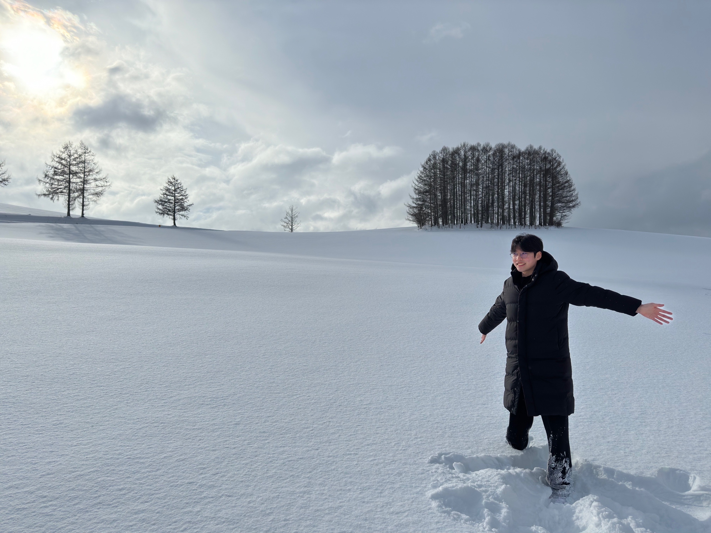

<!-- 프로필 섹션 -->

  

    
  

  <h1><b>Jungsik Oh</b></h1>
  <h3>Software Engineer</h3>
  
nemostar51@gmail.com

<a href="https://www.youtube.com/@TheRealOJung" target="_blank" style="margin-right:10px;">
  <i class="fa-brands fa-youtube fa-2x"></i>
</a>
 <a href="https://github.com/JungsikOh" target="_blank" style="margin-right:10px;">
    <i class="fa-brands fa-github fa-2x"></i>
  </a>

 

## Experience
- Incheon National University Feb 2019 ~ Present
	- Bachelor's degree, Computer Science
- Computer Vision Lab(CVLab) in Incheon National University Nov 2024 ~ Present

 

## Skills
- C++, DirectX, Vulkan
- Python, pytorch

 

## PPT
- [Review of MVSNet (ECCV 2018)](https://www.slideshare.net/slideshow/review-of-mvsnet-2018-_250110_ojung-pptx/275811840)
- [Review of SRNs (NIPS 2019)](https://www.slideshare.net/slideshow/scene-representation-networks-nips-2019-_ojung/275818168)
- [Review of Denoising Diffusion Probabilistic Models(NIPS 2020) and Denoising Diffusion Implicit Models(ICLR 2021)](https://www.slideshare.net/slideshow/review-of-denoising-diffusion-probabilistic-models-nips-2020-_ojung/275877937)

 
